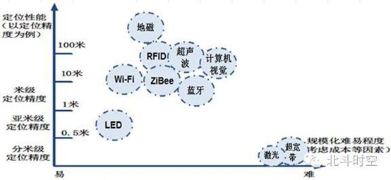
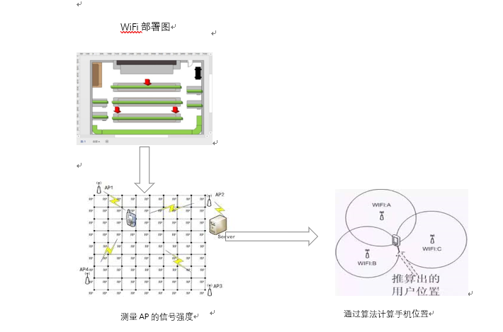

# android_wifi_location

## WIFI列表图片展示

=======
## 视频结果

## 一、定位的需求[背景](https://blog.csdn.net/huawei_eSDK/article/details/50777339)

- 工厂管理者希望精确追踪贵重物资和生产设备
- 消防员在滚股浓烟中需要进行有效救援
- 商场中，消费者希望准确定位商铺和货品
- 销售者希望实现精准的广告推送
- 智能家居，需要精准定位使用者位置
- 医院，价值价值千百万的贵重医疗设备需要管控
- 大人需要知晓人群中孩子的位置

## 二、WiFi定位优势及难点
[其他定位技术](https://www.zhihu.com/question/20485136)

[wifi电子标签](http://app.djkpai.com/87137.shtml)

### 优势

- 带宽优势
- WiFi芯片早已是手机及其他移动设备的标配
- AP的大量部署

### 难点

- 室内环境复杂
- 定位精度不能满足要求
- 解决方案的后期维护成本太高
- 产业链不成熟导致成本较高

## 三、实施过程

事先绘制好室内WiFi部署图，通过手机的WiFi芯片，获取周围WiFi的信号强度，通过信号衰减公式，计算手机与WiFi部署位置之间的距离，通过多个位置距离的计算，从而确定出手机所在位置。

## 四、代码框架

代码部分结构比较简单，但是实际每个部分包含的东西还是比较多，需要仔细考虑各个部分之间的衔接。以下是代码结构，核心部分是WiFi列表信息的获取。

1.	导入需要的各种包
2.	获取所需信息的权限
3.	在check函数中，使用语句wifiManager.getScanResults()获取WiFi列表信息，然后显示出来
4.	使用timer设置扫描信息的间隔

## 五、遇到的问题
1.单个WiFi信息转化为多个WiFi的列表信息。

刚开始进展还比较顺利，先后获取了WiFi名称，WiFi强度，获取时间，由于这些信息是链接上WiFi后获取的，而WiFi列表的信息要求在不连接WiFi的情况下，就能获取到这些信息。
所以，当时我们就在网上查找相关信息，关于这方面的资料还是比较多，其中使用一个语句就能获取到的所有信息。

2.WiFi列表的显示

信息获取到了，问题是要显示出来，随后我们又查找显示部分的代码，刚开始用的是一个for循环代码，一依次读人然后显示，但是一直出问题，后来就根据问题找相应的解决办法，最后通过scanBuilder.append这一句，直接进行显示。

3.WiFi列表不能刷新的问题

当我们要进行数据采集的时候，才发现，无论怎么移动，采集到的数据一直不变，这和我们的初衷相悖。一段时间都不能解决，后来和老师讨论后，老师建议查函数的具体用法，随后很快发现问题所在，代码中缺少一句启动扫描的代码，即wifiManager.startScan()，加上之后问题很快就解决了。

4.采集到的信息自动保存

为了解决人工记录数据费时费力的问题，我们决定把采集的数据自动保存为txt文档，随后在网上查找相应代码，然后主要尝试了两段代码，由于网上所提供的代码，主要是保存一小段信息，而我们要保存的是一个列表信息，所以数据类型转换是一个大问题，再尝试了一段时间后，依旧没有成功。
老师建议我们直接查关于数组存储方面的知识，这个问题目前还未解决，我们将继续尝试。

